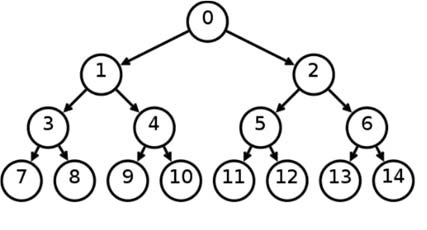

# Exercise 2

Implement a C program, thread_generation_tree, which receives a command line
parameter: n.
The main thread creates two other “children” threads and terminates.
Each child thread creates another two children threads, and terminates.
Thread creation stops after 2n leave threads have been created.
For example, if n=3, the main thread creates two children, and each child creates another two
threads for a total number of 8 leaves threads. At this point process creation stops.
Each leaf thread must print its generation tree, i.e., the sequence of thread identifiers from the main
thread. Example:



```
$ thread_generation_tree 3

Tread tree: 3077879488 3069483888 3052575600 3077876592
Tread tree: 3077879488 3069483888 3052575600 3035790192
Tread tree: 3077879488 3069483888 3060968304 3052575600
Tread tree: 3077879488 3069483888 3060968304 3027397488
Tread tree: 3077879488 3077876592 3044182896 3060968304
Tread tree: 3077879488 3077876592 3044182896 3019004784
Tread tree: 3077879488 3077876592 3069483888 3044182896
Tread tree: 3077879488 3077876592 3069483888 3010612080
```
